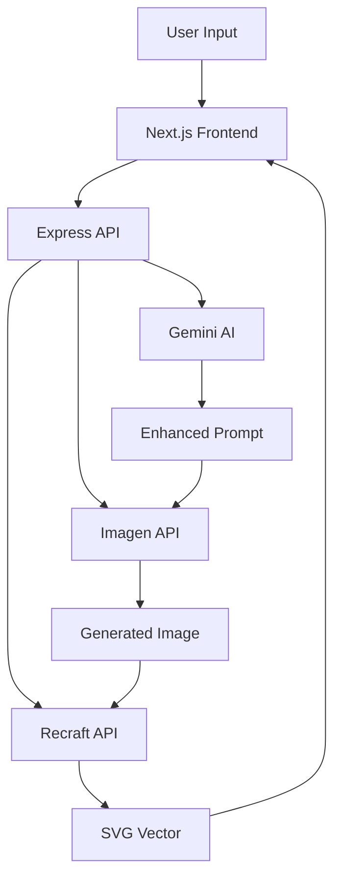

# 🎨 Vectoria AI - Advanced Vector Generation Platform

<div align="center">


**Transform text prompts into professional-grade SVG vectors using cutting-edge AI**

[🚀 Quick Start](#quick-start) • [📖 Documentation](#api-documentation) • [🎯 Features](#features) • [🛠️ Development](#development)

</div>

---

## ✨ Features

### 🎨 **AI-Powered Vector Generation**
- **Multi-stage AI Pipeline**: Gemini → Imagen → Recraft
- **Intelligent Prompt Enhancement**: Natural language processing for optimal results
- **Professional SVG Output**: Clean, optimized, scalable vector graphics

### 🎯 **Smart Inspiration System**
- **Style Extraction**: Analyze Freepik URLs for design inspiration
- **Similarity Detection**: Automatic originality checking
- **Style Recipes**: AI-generated design guidelines

### 🚀 **Modern Tech Stack**
- **Backend**: Node.js + Express with comprehensive API
- **Frontend**: Next.js 14 + TypeScript + Tailwind CSS
- **AI Services**: Google Gemini, Imagen, Recraft API
- **Architecture**: Microservices with robust error handling

### 🛡️ **Production Ready**
- **Rate Limiting**: Smart request throttling
- **Health Monitoring**: Comprehensive system status
- **Auto Cleanup**: Intelligent temp file management
- **Docker Support**: Container-ready deployment

---

## 🚀 Quick Start

### Prerequisites
- Node.js 18+ installed
- API keys for: Gemini, Imagen, Recraft, Freepik
- Git and npm/yarn

### 1. Clone & Install
```bash
git clone https://github.com/Craadly/Vectoria.git
cd Vectoria
npm install
cd frontend && npm install && cd ..
```

### 2. Environment Setup
Create `.env` in the root directory:
```env
# AI Service APIs
GEMINI_API_KEY=your_gemini_key_here
RECRAFT_API_KEY=your_recraft_key_here
FREEPIK_API_KEY=your_freepik_key_here

# Google Cloud (for Imagen)
GOOGLE_PROJECT_ID=your_project_id
GOOGLE_LOCATION=us-central1
IMAGEN_MODEL_ID=imagen-3.0-generate-001

# Server Configuration
PORT=3001
FRONTEND_URL=http://localhost:3000
TEMP_ACCESS_TOKEN=devtoken

# Temp Directory Settings
TEMP_DIR=./temp
TEMP_MAX_BYTES=536870912
TEMP_MAX_FILES=2000
```

Create `frontend/.env.local`:
```env
NEXT_PUBLIC_API_BASE=http://localhost:3001
TEMP_ACCESS_TOKEN=devtoken
```

### 3. Run the Application
```bash
# Terminal 1: Start Backend
npm run dev

# Terminal 2: Start Frontend
cd frontend && npm run dev
```

🎉 **Access your app**: 
- Frontend: http://localhost:3000
- Backend API: http://localhost:3001

---

## 🏗️ Architecture Overview



### 📁 Project Structure
```
Vectoria/
├── 🎨 frontend/           # Next.js React Application
│   ├── app/              # App Router pages
│   ├── lib/              # API client & utilities
│   └── package.json      # Frontend dependencies
├── 🚀 controllers/       # Request handlers
│   └── strategies/       # Generation strategies
├── 🔧 services/          # AI service integrations
├── 🛣️ routes/            # API route definitions
├── ⚙️ config/            # Environment configuration
├── 🛠️ utils/             # Helper utilities
├── 📦 temp/              # Temporary file storage
└── 🐳 Dockerfile         # Container configuration
```

---

## 🔄 How Vectoria Works

### 🎯 Generation Pipeline

1. **📝 Prompt Processing**
   - User submits text prompt via modern Next.js interface
   - Optional inspiration URLs analyzed for style extraction
   - Request routed through Express API with rate limiting

2. **🧠 AI Enhancement** ([`geminiService.js`](services/geminiService.js))
   - Gemini AI enhances and refines the prompt
   - Generates detailed style recipes and technical specifications
   - Optimizes for vector-friendly descriptions

3. **🎨 Image Generation** ([`imagenService.js`](services/imagenService.js))
   - Google Imagen creates high-quality raster image
   - Uses enhanced prompt for optimal results
   - Implements smart retry logic and error handling

4. **🔧 Vectorization** ([`recraftService.js`](services/recraftService.js))
   - Recraft API converts raster to clean SVG
   - Local Potrace fallback for reliability
   - Advanced SVG optimization and sanitization

5. **✨ Quality Control**
   - Similarity checking against inspiration sources
   - Automatic regeneration if too similar
   - Final optimization and delivery

### 🎛️ Strategy System

Advanced strategy pattern for handling different generation scenarios:

- **[`primaryPipeline.js`](controllers/strategies/primaryPipeline.js)** - Main generation flow
- **[`emergencyFallbackStrategy.js`](controllers/strategies/emergencyFallbackStrategy.js)** - Backup methods
- **[`rasterOnlyStrategy.js`](controllers/strategies/rasterOnlyStrategy.js)** - Image-only fallback
- **[`localPotraceStrategy.js`](controllers/strategies/localPotraceStrategy.js)** - Local vectorization

---

## 📡 API Documentation

### 🔥 Core Endpoints

#### `POST /api/generate`
Basic vector generation from text prompt.

**Request:**
```json
{
  "userPrompt": "a minimalist rocket icon",
  "style": "modern",
  "complexity": "simple",
  "colorMode": "monochrome"
}
```

**Response:**
```json
{
  "success": true,
  "svgContent": "<svg>...</svg>",
  "svgUrl": "/temp/vector_generated_123.svg?token=abc",
  "metadata": {
    "prompt": "enhanced prompt...",
    "generationTime": 15.2,
    "strategy": "primary"
  }
}
```

#### `POST /api/enhanced/generate`
Advanced generation with inspiration support.

**Request:**
```json
{
  "userPrompt": "futuristic car dashboard",
  "inspirationUrls": ["https://freepik.com/example"],
  "useInspiration": true,
  "checkSimilarity": true,
  "style": "tech",
  "complexity": "detailed"
}
```

#### `GET /api/health`
System health and service status.

**Response:**
```json
{
  "status": "healthy",
  "services": {
    "gemini": "✅ Connected",
    "imagen": "✅ Connected", 
    "recraft": "✅ Connected",
    "freepik": "✅ Connected"
  },
  "uptime": "2h 15m",
  "version": "3.0.0"
}
```

### 🎨 Inspiration Endpoints

- `POST /api/inspiration/extract` - Extract style from URLs
- `POST /api/inspiration/recipe` - Generate style recipes
- `POST /api/inspiration/check-similarity` - Compare for originality

### 📊 Metrics & Monitoring

- Comprehensive request logging with correlation IDs
- Performance metrics collection
- Automatic error summarization
- Health check endpoints for production monitoring

---

## 🛠️ Development

### 📋 Prerequisites
- **Node.js** 18.0.0 or higher
- **npm** 8.0.0 or higher
- **Git** for version control
- **API Keys** for all integrated services

### 🏃‍♂️ Local Development

1. **Install Dependencies**
   ```bash
   npm install
   cd frontend && npm install
   ```

2. **Environment Configuration**
   ```bash
   cp .env.example .env
   cp frontend/.env.example frontend/.env.local
   # Edit files with your API keys
   ```

3. **Start Development Servers**
   ```bash
   # Backend (Terminal 1)
   npm run dev
   
   # Frontend (Terminal 2)
   cd frontend && npm run dev
   ```

4. **Access Application**
   - 🎨 Frontend: http://localhost:3000
   - 🔧 Backend API: http://localhost:3001
   - 🩺 Health Check: http://localhost:3001/api/health

### 🐳 Docker Deployment

#### Development Container
```bash
docker build -t vectoria-dev .
docker run -p 3001:3001 --env-file .env vectoria-dev
```

#### Production Deployment
```bash
# Build production image
docker build -t vectoria-prod -f Dockerfile.prod .

# Run with compose
docker-compose up -d

# Health check
curl http://localhost:3001/api/health
```

### 🔍 Testing & Debugging

#### Enable Debug Mode
- **Query Parameter**: `?debug=1`
- **Header**: `x-debug: 1`
- **Environment**: `DEBUG=true`

#### Testing Endpoints
```bash
# Basic generation test
curl -X POST http://localhost:3001/api/generate \
  -H "Content-Type: application/json" \
  -d '{"userPrompt":"test rocket icon"}'

# Health check
curl http://localhost:3001/api/health

# With inspiration
curl -X POST http://localhost:3001/api/enhanced/generate \
  -H "Content-Type: application/json" \
  -d '{
    "userPrompt":"modern logo",
    "inspirationUrls":["https://example.com"],
    "useInspiration":true
  }'
```

---

## 🚀 Production Deployment

### 🌐 Environment Variables

#### Required API Keys
```env
GEMINI_API_KEY=your_gemini_api_key
RECRAFT_API_KEY=your_recraft_api_key
FREEPIK_API_KEY=your_freepik_api_key
```

#### Google Cloud Configuration
```env
GOOGLE_PROJECT_ID=your_gcp_project_id
GOOGLE_LOCATION=us-central1
IMAGEN_MODEL_ID=imagen-3.0-generate-001
```

#### Server Settings
```env
NODE_ENV=production
PORT=3001
FRONTEND_URL=https://your-domain.com
TEMP_ACCESS_TOKEN=secure_production_token
```

### 📊 Monitoring

- **Health Endpoint**: `/api/health`
- **Metrics Collection**: Automatic request/response logging
- **Error Tracking**: Comprehensive error summarization
- **Performance**: Built-in timing and performance metrics

### 🔒 Security Features

- **Rate Limiting**: Configurable request throttling
- **CORS Protection**: Whitelist-based origin control
- **Token Authentication**: Secure temp file access
- **Input Validation**: Comprehensive request sanitization

---

## 🤝 Contributing

### 📝 Guidelines

1. **Code Style**
   - Follow existing code patterns
   - Use meaningful variable names
   - Add JSDoc comments for functions
   - Maintain consistent indentation

2. **Git Workflow**
   ```bash
   git checkout -b feature/your-feature-name
   git commit -m "feat: add amazing feature"
   git push origin feature/your-feature-name
   ```

3. **Pull Request Process**
   - Ensure all tests pass
   - Update documentation if needed
   - Add changelog entry
   - Request review from maintainers

### 🐛 Bug Reports

Please include:
- **Environment details** (Node.js version, OS)
- **Steps to reproduce** the issue
- **Expected vs actual behavior**
- **Error logs** and stack traces

### 💡 Feature Requests

- Check existing issues first
- Describe the use case clearly
- Provide implementation suggestions
- Consider backward compatibility

---

## 📚 Advanced Configuration

### 🎛️ Strategy System

Extend generation capabilities by adding custom strategies:

```javascript
// controllers/strategies/myCustomStrategy.js
module.exports = async function myCustomStrategy(context) {
  // Your custom generation logic here
  return {
    success: true,
    svgContent: '...',
    metadata: { strategy: 'custom' }
  };
};
```

### 🔧 Service Integration

Add new AI services by implementing the service interface:

```javascript
// services/myAIService.js
class MyAIService {
  async processPrompt(prompt, options) {
    // Service implementation
  }
}
```

### 🛡️ Middleware

Custom middleware for specialized requirements:

```javascript
// middleware/customMiddleware.js
module.exports = (req, res, next) => {
  // Custom logic
  next();
};
```

---

## 📋 Core Components

### 🎮 Frontend Components
- **[`app/page.tsx`](frontend/app/page.tsx)** - Main application interface with tabbed navigation
- **[`lib/api.ts`](frontend/lib/api.ts)** - Centralized API client with type safety
- **Modern UI**: Built with Next.js 14, TypeScript, and Tailwind CSS

### 🚀 Backend Services
- **[`server.js`](server.js)** - Main application entry point
- **[`controllers/`](controllers/)** - Request handlers and business logic
- **[`services/`](services/)** - AI service integrations and utilities
- **[`routes/`](routes/)** - API endpoint definitions

### 🔧 Utilities & Configuration
- **[`config/env.js`](config/env.js)** - Environment configuration management
- **[`utils/cleanup.js`](utils/cleanup.js)** - Intelligent temp file cleanup
- **[`utils/metrics.js`](utils/metrics.js)** - Performance monitoring

---

## 🎯 Usage Examples

### 🖥️ Frontend Interface

Access the modern web interface at `http://localhost:3000`:

1. **Generate Tab**: Basic vector creation from text prompts
2. **Search Pipeline Tab**: Advanced generation with inspiration
3. **Inspiration Tab**: Style extraction and analysis tools

### 📡 API Integration

```javascript
// Using the built-in API client
import { api } from '@/lib/api';

// Basic generation
const result = await api.post('/api/generate', {
  userPrompt: 'minimalist rocket icon',
  style: 'modern'
});

// With inspiration
const enhanced = await api.post('/api/enhanced/generate', {
  userPrompt: 'futuristic dashboard',
  inspirationUrls: ['https://example.com/inspiration'],
  useInspiration: true,
  checkSimilarity: true
});
```

### 🐚 Command Line Testing

```bash
# Quick generation test
curl -X POST http://localhost:3001/api/generate \
  -H "Content-Type: application/json" \
  -d '{"userPrompt":"space rocket vector"}'

# Health check
curl http://localhost:3001/api/health

# Pipeline status
curl http://localhost:3001/api/pipeline/status
```

---

## 🔍 Troubleshooting

### Common Issues

#### ❌ **API Key Errors**
```bash
Error: GEMINI_API_KEY not configured
```
**Solution**: Ensure all required API keys are set in `.env`

#### ❌ **Port Already in Use**
```bash
Error: listen EADDRINUSE :::3001
```
**Solution**: Kill existing processes or use different ports
```bash
pkill -f "node server.js"
lsof -ti:3001 | xargs kill -9
```

#### ❌ **Frontend Build Errors**
```bash
Module not found: Can't resolve '@/lib/api'
```
**Solution**: Ensure TypeScript paths are configured correctly

### 🔧 Debug Mode

Enable comprehensive logging:
```bash
DEBUG=vectoria:* npm run dev
```

Or use query parameters:
```
http://localhost:3001/api/generate?debug=1
```

---

## 📈 Performance & Optimization

### ⚡ Performance Features
- **Concurrent Processing**: Parallel AI service calls
- **Smart Caching**: Intelligent result caching
- **Rate Limiting**: Configurable request throttling
- **Cleanup Scheduling**: Automatic temp file management

### 🎯 Optimization Tips
- Use appropriate `complexity` settings for faster generation
- Enable `checkSimilarity` only when needed
- Implement client-side caching for repeated requests
- Monitor temp directory size regularly

---

## 🛡️ Security & Best Practices

### 🔒 Security Features
- **CORS Protection**: Whitelist-based origin control
- **Rate Limiting**: Configurable request throttling  
- **Input Validation**: Comprehensive request sanitization
- **Token Authentication**: Secure temp file access

### 📋 Best Practices
- Keep API keys secure and never commit them
- Use environment-specific configurations
- Implement proper error handling in client code
- Monitor system resources and cleanup regularly
- Enable rate limiting in production environments

---

## 🆚 Version History

### 🎉 Version 3.0.0 - Current
- ✨ **New Next.js Frontend**: Modern React interface
- 🎨 **Enhanced UI/UX**: Tabbed navigation and real-time feedback
- 🔧 **Improved API**: Better error handling and response formats
- 📱 **Responsive Design**: Mobile-friendly interface
- 🛡️ **Security Enhancements**: Token-based authentication

### 📚 Previous Versions
- **v2.x**: Basic web interface with single-page application
- **v1.x**: API-only implementation with command-line interface

---

## 📞 Support & Community

### 🆘 Getting Help
- 📖 **Documentation**: Check this README and inline code comments
- 🐛 **Issues**: Report bugs via GitHub Issues
- 💡 **Discussions**: Join community discussions
- 📧 **Contact**: Reach out for enterprise support

### 🤝 Contributing
We welcome contributions! Please see our [Contributing Guidelines](#contributing) above.

### 📄 License
This project is licensed under the MIT License. See [LICENSE](LICENSE) file for details.

---

<div align="center">

**🎨 Built with ❤️ by the Vectoria Team**

[⭐ Star us on GitHub](https://github.com/Craadly/Vectoria) • [🐛 Report Bug](https://github.com/Craadly/Vectoria/issues) • [💡 Request Feature](https://github.com/Craadly/Vectoria/issues)

**Transform your ideas into professional vectors with AI-powered precision**

</div>